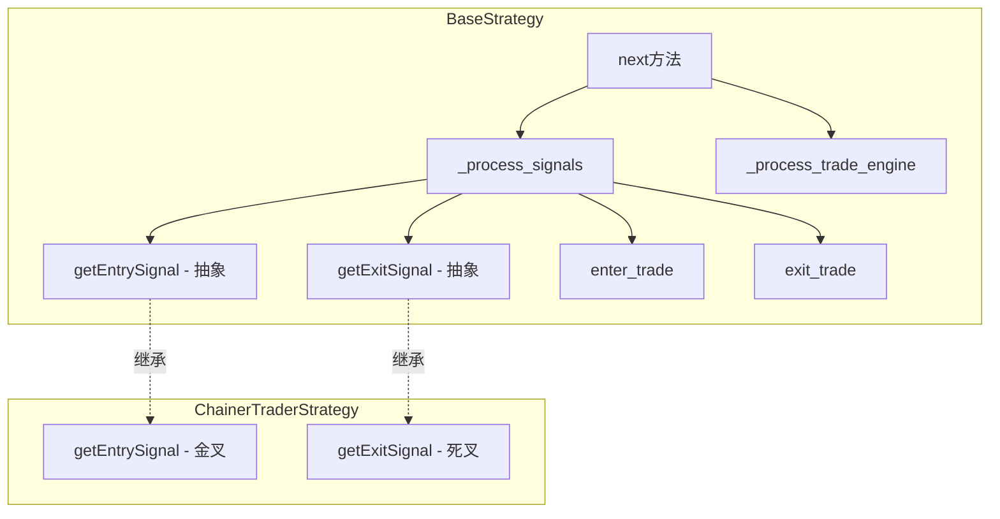

# Chainer Framework Backtrader 实现计划

## 当前状态分析

[base_strategy.py](src/trader/strategy/base_strategy.py) 已经具备：

- `TradeContext` 数据类管理交易状态
- `enter_trade()` / `exit_trade()` 方法
- `_process_trade_engine()` 处理进出场确认、保本移动止损、止损检查
- LONG/SHORT 方向支持
- ATR 止损倍数支持

缺失的部分：

- 没有 `getEntrySignal()` / `getExitSignal()` 抽象接口
- 策略需要手动调用 `enter_trade()` 和 `exit_trade()`
- 缺少自动化的信号驱动逻辑

---

## 实现计划

### 1. 修改 BaseStrategy 添加信号驱动机制

在 [base_strategy.py](src/trader/strategy/base_strategy.py) 中：**1.1 添加抽象信号接口**

```python
def getEntrySignal(self) -> bool:
    """Override in subclass to generate entry signal."""
    return False

def getExitSignal(self) -> bool:
    """Override in subclass to generate exit signal."""
    return False
```

**1.2 添加新参数**

```python
params = (
    # ... existing params ...
    ("chainer_direction", "LONG"),  # LONG or SHORT
    ("chainer_auto_signal", True),  # Enable auto signal processing
)
```

**1.3 修改 `next()` 方法**在 `_process_trade_engine()` 之前添加信号检测逻辑：

```python
def next(self):
    super().next()
    # ... existing code ...
    
    # Auto signal processing (if enabled)
    if self.params.chainer_auto_signal:
        self._process_signals()
    
    # Drive entry/exit engine
    self._process_trade_engine()
```

**1.4 添加 `_process_signals()` 方法**实现方向感知的信号处理逻辑（参考 Pine Script 版本）：

- LONG 方向：entry signal 进场，exit signal 出场
- SHORT 方向（且允许做空）：exit signal 进场，entry signal 出场

---

### 2. 创建 ChainerTraderStrategy 模板策略

新建 [src/trader/strategy/chainer_trader.py](src/trader/strategy/chainer_trader.py)参考 `super_trend_qqe_mod.py` 的命名风格：

- 文件名：小写下划线 `chainer_trader.py`
- 类名：`ChainerTraderStrategy`

**2.1 策略参数**

```python
params = (
    ("name", "ChainerTrader"),
    ("fast_length", 9),
    ("slow_length", 21),
)
```

**2.2 实现信号函数**

```python
def getEntrySignal(self) -> bool:
    # Golden cross: fast SMA crosses above slow SMA
    return self.fast_sma[-1] <= self.slow_sma[-1] and self.fast_sma[0] > self.slow_sma[0]

def getExitSignal(self) -> bool:
    # Death cross: fast SMA crosses below slow SMA
    return self.fast_sma[-1] >= self.slow_sma[-1] and self.fast_sma[0] < self.slow_sma[0]
```

---

## 架构图



---

## 文件改动