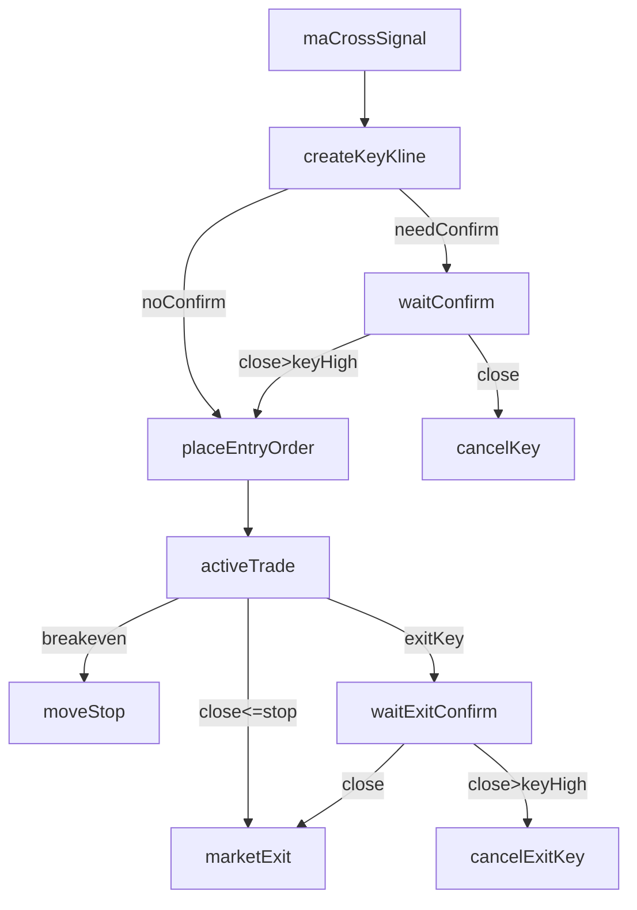

# 实现进出场函数（TradingView + Backtrader）

## 范围与对齐原则

- **现货单向**：仅支持做多；传入做空直接抛错（Backtrader）/输出错误状态（Pine）。
- **成交时机对齐**：Backtrader 按你选择的 **默认 next open 成交**（信号在 close 判定，下单后下一根 open 成交）。Pine 侧因为是 indicator 不下单，所有“成交价/入场价”以 **确认触发时的 close（或信号 bar close）** 做展示与调试字段。
- **单活跃交易**：任意时刻最多 1 笔未出场交易对象。

## Backtrader（Python）

### 1) 交易对象与状态机

- 在 `BaseStrategy` 内引入“交易对象”（trade context），字段满足你的返回结构：
  - `trade_id`（递增）
  - `key`（字符串，查重）
  - `order`（未确认时为空；确认/立即入场时创建订单并关联）
  - `key_kline_ref`（可复用引用：至少包含 key bar 的 datetime + high/low，用于后续确认/失败判定）
  - `stoploss_atr_mult`（保留入参）
  - 额外的运行态字段：状态（pending_entry_confirm / active / pending_exit_confirm / closed / cancelled）、`entry_price`、`stop_price`、`breakeven_step` 等（用于保本与止损判断）。

### 2) 在 `BaseStrategy` 增加进场/出场函数

- 文件：[`/Users/tonyoutlier/github.com/ChainerLabs/ChainerTrader/src/trader/strategy/base_strategy.py`](/Users/tonyoutlier/github.com/ChainerLabs/ChainerTrader/src/trader/strategy/base_strategy.py)
- 新增方法（名称可根据现有风格调整）：
  - `enter_trade(trade_key: Any = None, direction: str = 'LONG', key_kline_idx: int = 0, stoploss_atr_mult: float | None = None, need_confirm: bool | None = None, enable_breakeven: bool | None = None, risk_reward_ratio: float | None = None) -> TradeContext`
  - `exit_trade(trade_ref: int | str | None = None, key_kline_idx: int = 0, need_confirm: bool | None = None) -> TradeContext | None`
- 参数默认值与校验：
  - `trade_key`：非字符串转字符串；为空则用 key bar 的时间生成简短 key（例如 `YYYYMMDDHHMM`）；与历史/当前交易查重。
  - `direction`：仅允许 LONG。
  - `key_kline_idx`：默认 0；保存 key bar 的 datetime/high/low，后续用 datetime 做引用（避免 bar 索引滑动问题）。
  - 进场参数 4~7、出场参数 3：支持从 `BaseStrategy.params` 提供默认值（下面“可配置参数”）。

### 3) 确认规则（进场/出场）

- 进场（做多）：
  - **确认成功**：后续任一 bar `close > key_high` → 创建市价买单（下一根 open 成交），并记录订单与 `trade_id` 关联。
  - **确认失败**：后续任一 bar `close < key_low` → 取消该 key（本次交易对象标记 cancelled），并把该 key bar（以 datetime 标识）加入“禁止集”，未来即使再次出现确认条件也不再入场。
- 出场（做多）：
  - **确认成功**：后续任一 bar `close < key_low` → 创建市价卖单平仓。
  - **确认失败**：后续任一 bar `close > key_high` → 取消该 key（本次出场请求作废），并把该 key bar（datetime）加入“禁止集”，未来不再基于该 key 出场。

### 4) 止损与保本策略

- 初始止损价：以 key bar `low` 为基准；如果 `stoploss_atr_mult != 0`，则 `stop = low - stoploss_atr_mult * ATR`。
- ATR 取值：沿用 `BaseStrategy` 的 `atrperiod`（必要时在进出场逻辑里保证 ATR 指标可用）。
- 保本（启用且 `risk_reward_ratio > 0`）：
  - 定义风险 `risk = entry_price - initial_stop_price`。
  - 当价格达到 `entry_price + n * risk_reward_ratio * risk`（n=1,2,3...）时，把止损移动到 `entry_price + (n-1) * risk_reward_ratio * risk`。
  - Backtrader 侧不依赖“可修改止损单”，采用 **每根 bar 检查** 的方式：若 `close <= stop_price` 则市价平仓。

### 5) `BaseStrategy.params` 可配置项

按你确认的范围：

- 进场参数：
  - `entry_stoploss_atr_mult`（默认 0）
  - `entry_need_confirm`（默认 true）
  - `entry_enable_breakeven`（默认 true）
  - `entry_risk_reward_ratio`（默认 0）
- 出场参数：
  - `exit_need_confirm`（默认 true）

### 6) 日志对齐

- Backtrader 在以下事件打 `log_info`/`log_debug`：创建交易、确认成功/失败、创建订单、成交回报（复用 `notify_order`）、止损触发、保本档位变更。
- 字段命名与 Pine debug 尽量一致：`trade_id/key/key_time/key_high/key_low/entry_price/stop_price/rr/atr/...`。

## TradingView（Pine v6）

### 1) Library：只计算进出场所需的参数数据

- 新增文件：`/Users/tonyoutlier/github.com/ChainerLabs/ChainerTrader/src/pine_scripts/libraries/entry_exit.pine`
- 提供 export 函数（示例）：
  - `export entryKeyLevels(int keyIdx) => [time[keyIdx], high[keyIdx], low[keyIdx]]`
  - `export entryStopPrice(int keyIdx, int atrPeriod, float slAtrMult) => stopPrice`
  - `export exitKeyLevels(int keyIdx) => [time[keyIdx], high[keyIdx], low[keyIdx]]`
  - （保本相关只返回计算所需的中间量/阈值，不做下单）

### 2) Indicator：MA Cross 触发，调用库函数，并支持 debug

- 新增文件：`/Users/tonyoutlier/github.com/ChainerLabs/ChainerTrader/src/pine_scripts/indicators/ma_cross_entry_exit.pine`
- 输入参数（每个都加注释/标题/分组）：
  - **MA Cross**：`fastLen`、`slowLen`、`src`（与 Backtrader 测试保持一致，用 SMA + close/可选 source）。
  - **Entry(4~6 可配)**：`stoplossAtrMult`、`needConfirm`、`enableBreakeven`（以及 `riskRewardRatio`）。
  - **Exit(3 可配)**：`exitNeedConfirm`。
  - **debug**：`debugStartTime`（`input.time(defval=na)`）；当 `time >= debugStartTime` 时，对“进出场库函数相关变量”每根 bar `log.info` 输出。
- 逻辑：
  - MA 上穿：记录 entry key bar（信号 bar）并计算 stop；若不需要确认则立即标记“入场生效”，否则等待确认/失败。
  - MA 下穿：记录 exit key bar；若不需要确认则立即标记“出场生效”，否则等待确认/失败。
  - 画图：
    - key bar 标记（entry/exit）
    - confirmed entry/exit 标记
    - stop line（含保本后的 stop 变更）

## 测试（pytest + backtrader）

- 新增测试策略：`tests/` 下新增或扩展现有测试文件（优先扩展 [`/Users/tonyoutlier/github.com/ChainerLabs/ChainerTrader/tests/test_strategy.py`](/Users/tonyoutlier/github.com/ChainerLabs/ChainerTrader/tests/test_strategy.py) 若其结构合适）。
- 策略内容：
  - 使用 `bt.indicators.SMA` + `bt.indicators.CrossOver`（或等价）实现 MA Cross。
  - 上穿调用 `enter_trade(...)`，下穿调用 `exit_trade(...)`。
  - MA 参数命名/默认值与 Pine indicator 一致。
- 断言点：
  - 交易对象创建、trade_id 递增、key 去重
  - 确认成功/失败的状态转移
  - 不确认模式下立即下单
  - 保本档位触发时 stop_price 更新
  - 日志关键行包含一致字段（以关键字匹配为主，避免对价格浮点做脆弱断言）

## 关键数据流（示意）

