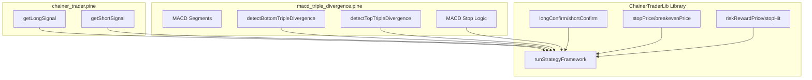

## 目标

- **抽象通用交易框架**：把当前 `[S]Chainer` 模板中的交易状态机、止损/止盈、确认、保本、调试等逻辑提取到库 `[src/pine_scripts/libraries/chainer_trader.pine](src/pine_scripts/libraries/chainer_trader.pine)` 中。
- **简化策略模板**：让 `[src/pine_scripts/strategies/chainer_trader.pine](src/pine_scripts/strategies/chainer_trader.pine)` 成为一个极薄的示例壳，主要展示如何实现 `getLongSignal()` / `getShortSignal()` 并调用库。
- **重写 MACD 三重背离策略**：基于新库重构 `[src/pine_scripts/strategies/macd_triple_divergence.pine](src/pine_scripts/strategies/macd_triple_divergence.pine)`，只保留 MACD 背离检测与特殊 MACD 止损逻辑，其余交易流程全部用库函数驱动。

## 拆分现有职责

- **识别通用逻辑（可入库）**
  - 从 `chainer_trader.pine` 中提取：
    - **交易模式管理**：`LONG_ONLY` / `SHORT_ONLY` / `BOTH` 模式的进出场规则与状态组合。
    - **交易状态结构**：`tradeId`, `pendingLong/Short`, `longKeyBarIndex/shortKeyBarIndex`, `initialStop`, `stopPrice`, `entryPrice`, `takeProfitPrice`, `breakevenStep`, `currentDirection` 等。
    - **信号管线**：原始信号 `getLongSignal/getShortSignal` → 自定义时间信号 → 最终信号 `longSignal/shortSignal`。
    - **确认流程**：通过 `longConfirm/shortConfirm` 以及 `pendingLong/Short` 实现的确认成功/失败逻辑。
    - **止损/止盈**：基于 `stopPrice` 与 `riskRewardPrice` 的退出规则与 `strategy.exit` 调用。
    - **保本处理**：`breakevenPrice` 的使用和 `breakevenStep` 递增逻辑。
    - **调试日志和关键 K 线信息打印**。
  - 从 `macd_triple_divergence.pine` 中提取可泛化的部分：
    - 与模式/状态相关但与 MACD 无关的逻辑（大部分 LONG_ONLY/SHORT_ONLY/BOTH 状态机，与模板高度重叠）。
    - 重置状态与通用 SL/TP 标签绘制逻辑等。
- **识别策略特有逻辑（保留在策略脚本）**
  - MACD 三重背离检测：`updateSegments`, `detectBottomTripleDivergence`, `detectTopTripleDivergence` 及相关数组结构。
  - 特殊 MACD 止损：`entryHistVal`、`checkMacdStopLoss` 以及 `macdStopSignal` 相关的 `strategy.close_all` 行为。
  - 与该策略特有的可视化（如 BD/TD 标记）和特定标签样式。

## 新库 API 设计（signals_only 风格）

- **核心思想**：
  - 策略脚本只关心：**如何产生信号** 和 **如何配置参数**。
  - 库负责：**状态机、模式、止损/止盈、确认、保本、调试与通用画图（如止损/止盈线）**。
- **状态结构与初始化**
  - 在库中定义 `type StrategyState`（通过多个 `var` + 结构化 getter/setter 模拟），并导出：
    - `export initState() => StrategyState`：初始化默认状态。
    - `export resetState(state) => StrategyState`：重置当前交易状态，返回新状态。
  - 若 Pine 类型限制不便直接封装成 record，则使用 **元组 + 解构** 方式：
    - 例如 `state = [tradeId, pendingLong, pendingShort, longKeyBarIndex, shortKeyBarIndex, initialStop, stopPrice, entryPrice, takeProfitPrice, breakevenStep, currentDirection]`。
    - 导出 `export initState()` 和 `export unpackState(state)` / `packState(...)` 等工具函数。
- **统一的每根 K 线驱动函数**
  - 在库中定义一个主流程函数，例如：
    - `export runStrategyFramework(string strategyName, string shortName, string mode, float stoplossAtrMult, bool enterNeedConfirm, bool exitNeedConfirm, bool enableBreakeven, float riskRewardRatio, int longTime, int shortTime, int debugStartTime, bool longSignalRaw, bool shortSignalRaw, bool extraStopSignal, bool extraExitLongSignal, bool extraExitShortSignal) => FrameworkOutputs`。
  - 函数内部：
    - 根据传入的 `longSignalRaw/shortSignalRaw` 生成最终 `longSignal/shortSignal`（支持 input.time 覆盖）。
    - 维护交易状态机：调用内部 `enterLong/enterShort/exitPosition` 等私有函数。
    - 处理 **模式差异**：`LONG_ONLY` / `SHORT_ONLY` / `BOTH` 的进出策略。
    - 处理 `longConfirm/shortConfirm` 确认逻辑，自动操作 `strategy.entry/strategy.close/strategy.close_all/strategy.exit`。
    - 处理 `breakevenPrice` 与 `riskRewardPrice` 推导的 `stopPrice` / `takeProfitPrice` 动态更新。
    - 根据 `extraStopSignal` / `extraExitLongSignal` / `extraExitShortSignal` 执行策略自定义出场（如 MACD 止损、特殊信号平仓）。
    - 返回 `FrameworkOutputs`（包括：当前状态、信号标记、止损/止盈价、是否止损/止盈触发等）。
- **通用输出结构**
  - 定义框架输出，例如：
    - `export type FrameworkOutputs`（或同样用元组表示），包含：
      - `bool longSignal, shortSignal`（最终信号）
      - `bool longConfirm, longFail, shortConfirm, shortFail`
      - `float stopPrice, takeProfitPrice`
      - `bool stopHit, bool breakevenUpdated`
      - `string currentDirection`
      - 以及状态重新打包后的结构 `stateOut`。
- **附加绘图与调试接口**
  - 导出小函数，供策略根据需要调用：
    - `export plotStopAndTakeProfit(float stopPrice, float takeProfitPrice, bool hasPosition)`。
    - `export debugLog(string strategyName, ...other fields...)`。
  - 模板策略可以直接调用这些函数，而 MACD 策略可以只选择性使用。
- **与现有库 API 兼容**
  - 保留并继续使用现有库函数：`normalizeDirection`, `keyLevelsByBarIndex`, `stopPrice`, `longConfirm`, `shortConfirm`, `breakevenPrice`, `riskRewardPrice`, `stopHit`。
  - 新增一组 `framework_*` 前缀的函数，避免与旧代码冲突，方便旧策略逐步迁移。

## 重构模板策略 `chainer_trader.pine`

- **改为使用新库驱动**
  - 引用内部库：`import outliertony/ChainerTrader/2 as ChainerTraderLib`（对应本地 `libraries/chainer_trader.pine`）。
  - 保留简单 MA Cross 作为默认 `getLongSignal` / `getShortSignal` 示例。
  - 使用 `var` 声明单一 `state` 变量，并在每根 K 线调用 `ChainerTraderLib.runStrategyFramework(...)`：
    - 把框架参数（模式、止损 ATR 倍数、确认开关、保本开关、RR 等）及 `getLongSignal()` / `getShortSignal()` 返回值作为输入传入。
    - 把返回的 `stateOut` 重新赋值给 `state`，同时提取 `longConfirm` 等布尔结果用于 `plotshape`。
  - 删除模板中所有手写的 LONG_ONLY / SHORT_ONLY / BOTH 分支状态机、保本/止盈管理、确认逻辑等，只保留：
    - 输入参数定义
    - 信号函数
    - 调用库与绘制基础指标。
- **确保默认行为一致**
  - 对比旧模板与新模板在同一参数下的交易信号与订单行为（逻辑比对设计层面，真正运行留给后续实现步骤）。

## 基于新库重写 `macd_triple_divergence.pine`

- **保留并聚焦 MACD 背离检测**
  - 直接复用现有 MACD 与分段逻辑：
    - `updateSegments()` + `detectBottomTripleDivergence()` + `detectTopTripleDivergence()`。
  - 定义：
    - `getLongSignal() => detectBottomTripleDivergence()`
    - `getShortSignal() => detectTopTripleDivergence()`
- **使用库的统一框架**
  - 与模板类似，引入 `ChainerTraderLib` 新版库，并在每根 K 线上调用 `runStrategyFramework(...)`：
    - `longSignalRaw` / `shortSignalRaw` 为背离检测结果。
    - 传入 MACD 策略特有的 `extraStopSignal = macdStopSignal`（由本脚本内部用 `entryHistVal` 和当前 `histLine` 计算）。
    - 如有需要，也可以通过 `extraExitLongSignal` / `extraExitShortSignal` 让框架直接根据 MACD 条件平仓。
  - 删除原脚本中：
    - 各模式下的 `strategy.entry` / `strategy.close` / `strategy.close_all` 手动状态机逻辑。
    - 重复的 `breakeven`、止损检查、`resetTradeState` 等，与新库中的框架重复部分。
- **保留策略特有的画图与说明**
  - 继续保留：
    - `plotshape` 标记 BD/TD 位置。
    - MACD 专属的止损标记 `macdStopSignal` 的可视化。
  - 将 TP/SL 标签绘制委托给库提供的通用函数（如有设计），避免策略层重复实现。

## 结构与调用关系示意（Mermaid）

## 实施顺序

- **步骤 1：扩展库**
  - 在 `chainer_trader.pine` 库中添加 `initState`、`runStrategyFramework` 及相关辅助类型/函数，保持与现有导出函数兼容。
- **步骤 2：重构模板策略**
  - 改写 `chainer_trader.pine` 策略文件，去掉本地状态机，改为使用库框架。
  - 保持参数命名和默认值不变，以方便后续策略对照迁移。
- **步骤 3：重构 MACD 三重背离策略**
  - 引入新库，删除重复状态机，接入 `runStrategyFramework`。
  - 用库的输出绘制通用 SL/TP/确认标记，只保留 MACD 特有的可视化与止损触发。
- **步骤 4：比对与回归检查（逻辑层面）**
  - 用同一参数，在逻辑上对比旧实现与新实现的：
    - 入场/出场条件
    - 止损/止盈与保本调整条件
    - 模式切换行为（LONG_ONLY/SHORT_ONLY/BOTH）。
  - 根据需要微调库函数签名或输出结构，使策略端调用尽量简洁明了。

