# MACD柱形图三段顶背离和三段底背离

**作者：**半木夏  
**发布时间：**2025-11-09  
**发布地：**发布于 江苏  
**来源：**<https://weibo.com/ttarticle/p/show?id=2309405231053425475781>

<figure>
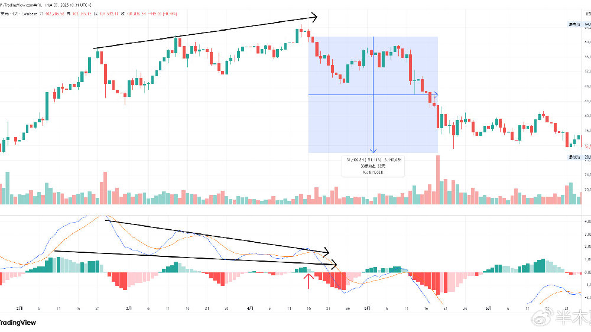
<figcaption aria-hidden="true">题图</figcaption>
</figure>

       今天详细介绍下MACD柱形图三段顶背离和三段底背离（以前我把它叫做半木夏背离，属实有点幼稚轻狂了）。这个技术形态不是我发明的，使用这个的我肯定也不是第一个，但是我应该是第一个把这个形态做了比较详细的介绍和使用的，下面我就详细说明下这个指标形态在比特币市场的运用。

  

## 指标形态说明

1.首先MACD指标参数就用最常用的，快线12，慢线26，平滑周期9。

2.MACD柱形图三段顶背离：价格指数依次出现了三个高点，同时MACD柱形图绿柱依次出现了两次缩短，即出现了连续两次MACD柱形图顶背离。（注意K线设置是绿涨红跌，如果是红涨绿跌，那就是红柱缩短。）

3.MACD柱形图三段底背离：价格指数依次出现了三个低点，同时MACD柱形图红柱依次出现了两次缩短，即出现了连续两次MACD柱形图底背离。

特别说明：每段绿柱或者红柱之间要有相反颜色的MACD柱出现，或者非常接近出现。否则不作为一段上涨或者下跌。如下图是一个普通的背离，而不是三段背离。

<figure class="image">
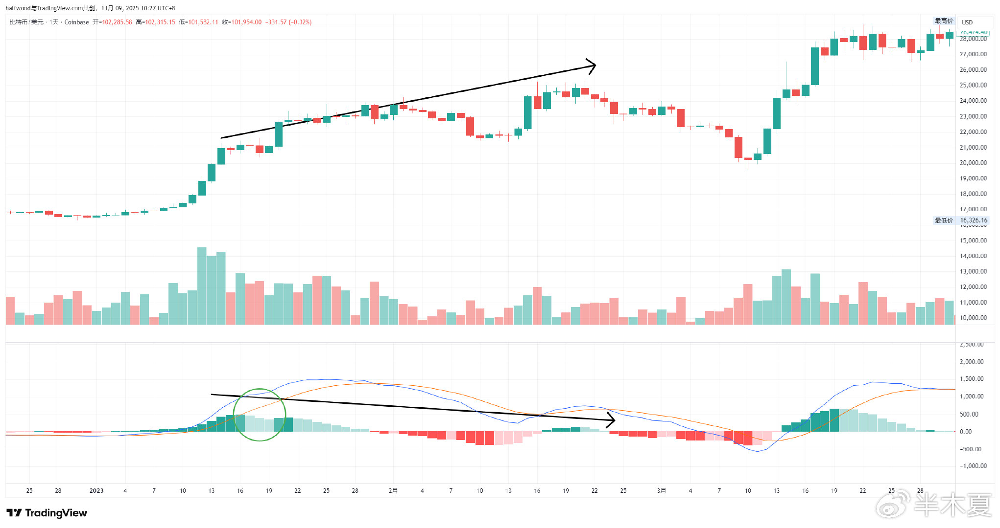
<figcaption>普通背离</figcaption>
</figure>

4.入场时机：

三段顶背离的入场时机在第三次价格高点出现后，并且确认绿柱缩短的那天早上8点收日线的时候。

<figure class="image">
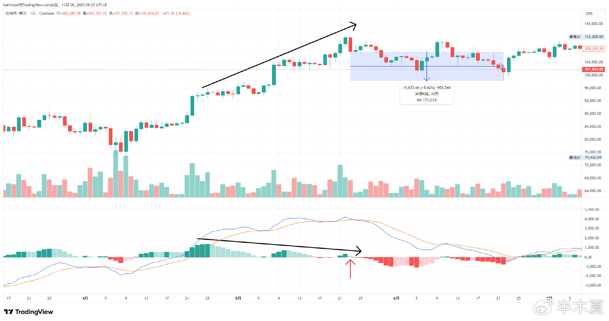
<figcaption>MACD柱形图三段顶背离</figcaption>
</figure>

三段底背离的入场时机在第三次价格低点出现后，并且确认红柱缩短的那天早上8点收日线的时候。

<figure class="image">
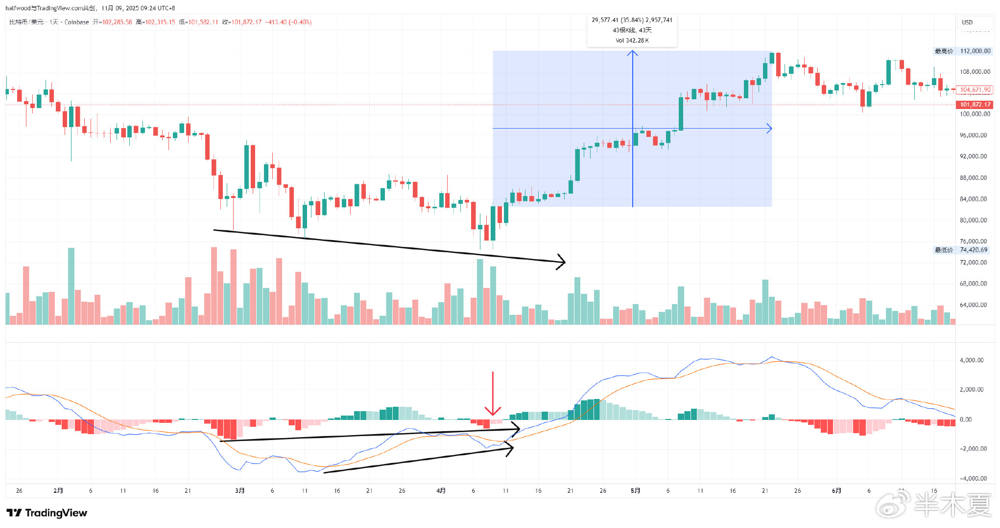
<figcaption>MACD柱形图三段底背离</figcaption>
</figure>

5.离场时机：

止损方面，顶背离做空时以第三个高点价格作为止损位，底背离做多时以第三个低点价格作为止损位。同时，非常重要的是，顶背离做空信号第二天收盘绿柱没有继续缩短，即可立即止损。同理，底背离做多信号第二天收盘红柱没有继续缩短，即可立即止损（文字可能比较难理解，继续看下文的详细案例就会明白）。止盈位置根据行情走势，使用波浪理论或者其他技术形态判断。

6.效用时长：相应级别15-50根K线。比如日线级别的三段顶背离后，该指标形态指示的下跌时长可能是15-50天。

7.建议使用级别：日线和4H级别。因为1H级别的效用只有15-50个小时，也就是1-2天，这么短线的交易不确定性过大。当然，如果你本身就是超级短线的交易者，也可以尝试。

8.指标形态意义：背离意味着相应的价格势能的减弱，顶背离意味着上涨势能的减弱，底背离意味着下跌势能的减弱。因此，当出现连续两次势能减弱的时候，意味着该价格趋势可能要逆转。

9.为什么是3段，而不是4段或者5段：首先，更多段的背离出现的概率太小，即使是日线级别的三段背离，平均一年也就出现1-2次。其次，完整的三段上涨或下跌，相应的中间会有两次调整，一共组成了一段完整的5浪驱动，这时，完成了整个上涨或者下跌的概率很大。

 

## 具体案例解析

在案例解析中只寻找最近7年的日线级别的MACD柱形图三段背离。

 

**1.MACD柱形图三段顶背离**

1.1  2025年5月23日

<figure class="image">

<figcaption>2025年5月23日MACD柱形图三段顶背离</figcaption>
</figure>

5月23日收盘确定绿柱缩短，收盘价格107329，经过30天到达低点98225，跌幅8.4%左右。

 

1.2  2024年10月31日

<figure class="image">
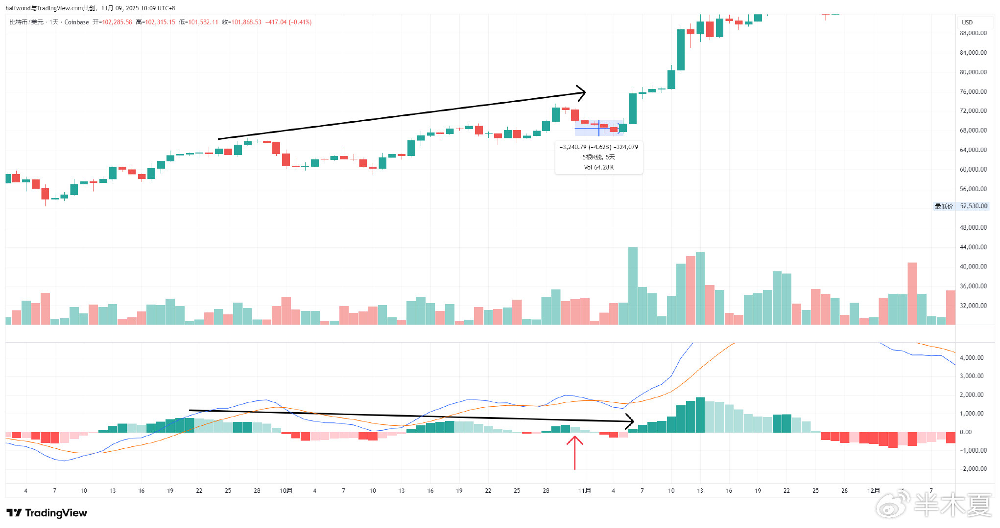
<figcaption>2024年10月31日MACD柱形图三段顶背离</figcaption>
</figure>

10月31日收盘确定绿柱缩短，但是下跌只持续了5天，跌幅只有4.6%左右。这显然会是一次失败的交易，注意这次对应着后来特朗普当选总统的事件。

 

1.3  2024年1月11日

<figure class="image">
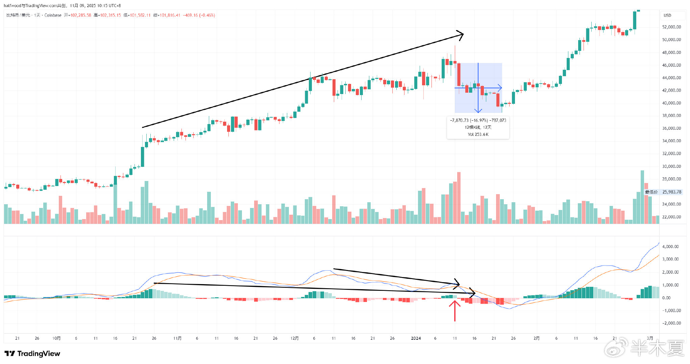
<figcaption>2024年1月11日MACD柱形图三段顶背离</figcaption>
</figure>

1月11日收盘确定绿柱缩短，收盘价46342，经过12天到达低点38501，跌幅17%左右。注意这个案例在柱形图三段背离完成的时候，MACD线也实现了背离，这更加意味着上涨势能的衰竭。这次也跟随着比特币ETF通过事件和紧接着灰度的抛售。

 

1.4  2021年4月16日

<figure class="image">
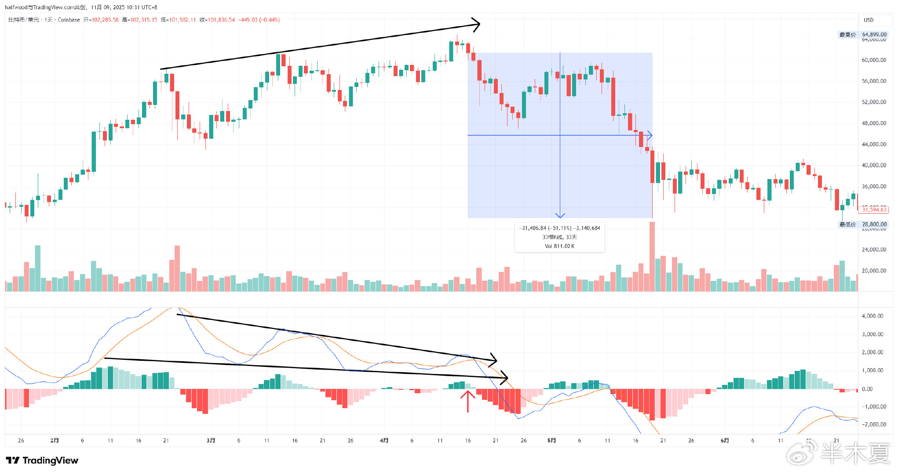
<figcaption>2021年4月16日MACD柱形图三段顶背离</figcaption>
</figure>

这是一次非常经典的三段顶背离，甚至MACD线也出现了三段顶背离。4月16日三段顶背离成立时收盘价61427，经过33天到达低点30000，跌幅51%左右。

 

1.5  2020年6月2日

<figure class="image">
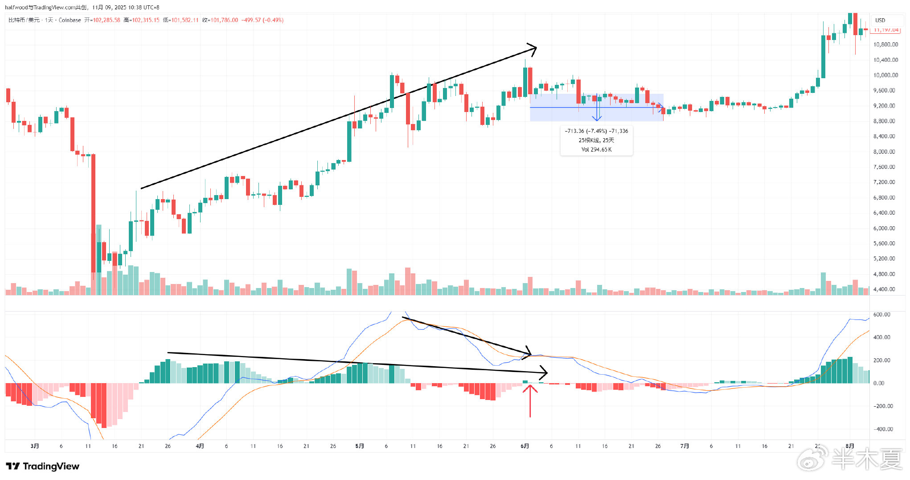
<figcaption>2020年6月2日MACD柱形图三段顶背离</figcaption>
</figure>

6月2日收盘确定绿柱缩短，收盘价9522，经过25天到达低点8815，跌幅7.5%左右。

 

1.6  2020年2月13日

<figure class="image">
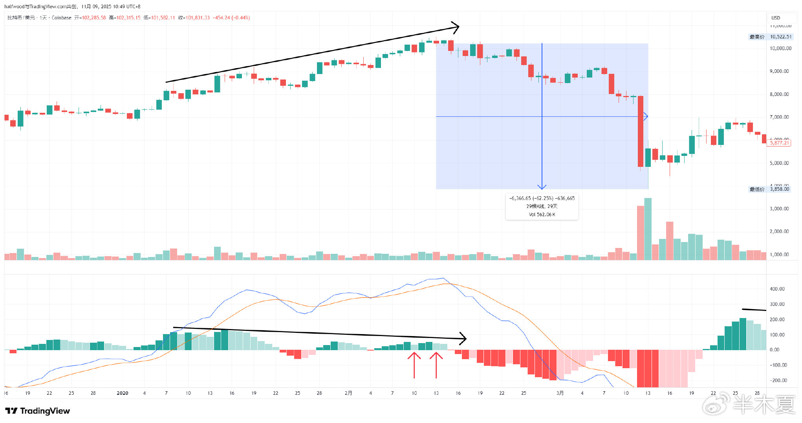
<figcaption>2020年2月13日MACD柱形图三段顶背离</figcaption>
</figure>

这个案例需要注意的是在2月10日就出现了入场信号，那次入场结果是止损，9851入场，第二天绿柱没有继续缩短，但已经在第三个高点10199止损，损失幅度3.5%。所以交易的时候可以先设置第三个高点10199作为止损价，如果第二天收盘绿柱没有继续缩短，但还没有超过10199，也立即止损。

紧接着2月13日又出现了一次入场信号，2月13日收盘收盘价10236，经过29天到达低点3858，跌幅62%左右。用3.5%的止损换来62%的盈利，还是很划算的。（这个案例第三段和第二段的绿柱高度差不多，但是确实第三段是缩短的，第二段高点数值是52.8，第三段高点数值是51.5）

 

       最近7年日线级别的MACD柱形图三段顶背离就出现了这6次，成功率算是很不错的，但是有失败的案例，这再次提醒做好交易计划，尤其是做好止损计划的重要性。

 

**2.MACD柱形图三段底背离**

2.1  2025年4月9日

<figure class="image">
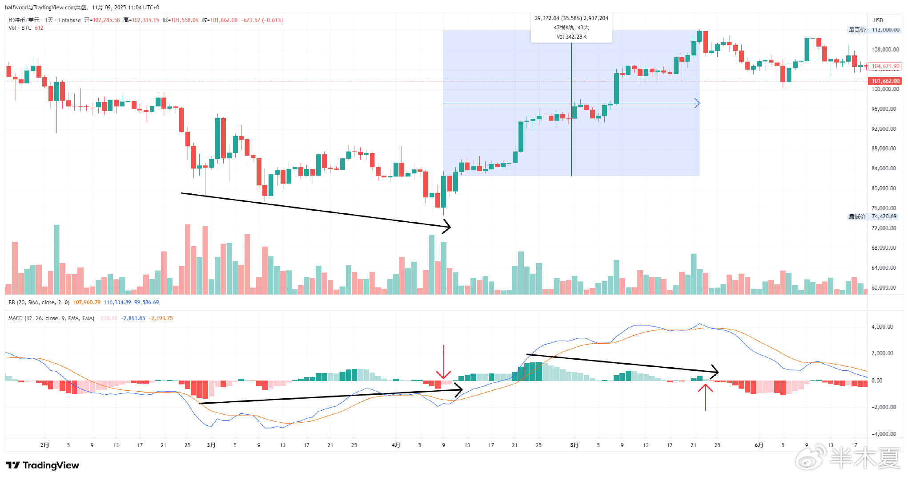
<figcaption>2025年4月9日MACD柱形图三段底背离</figcaption>
</figure>

4月9日收盘确定红柱缩短，收盘价82594，经过43天到达高点112000，涨幅35.5%左右。这次有意思的是后面接着三段顶背离，如果在三段底背离时入场，在三段顶背离时出场，能收获不小的收益。

 

2.2  2024年5月3日

<figure class="image">
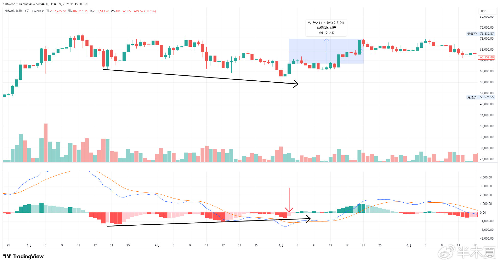
<figcaption>2024年5月3日MACD柱形图三段底背离</figcaption>
</figure>

5月3日收盘确定红柱缩短，收盘价62913，经过18天到达高点71980，涨幅14.6%左右。

 

2.3  2023年6月15日

<figure class="image">
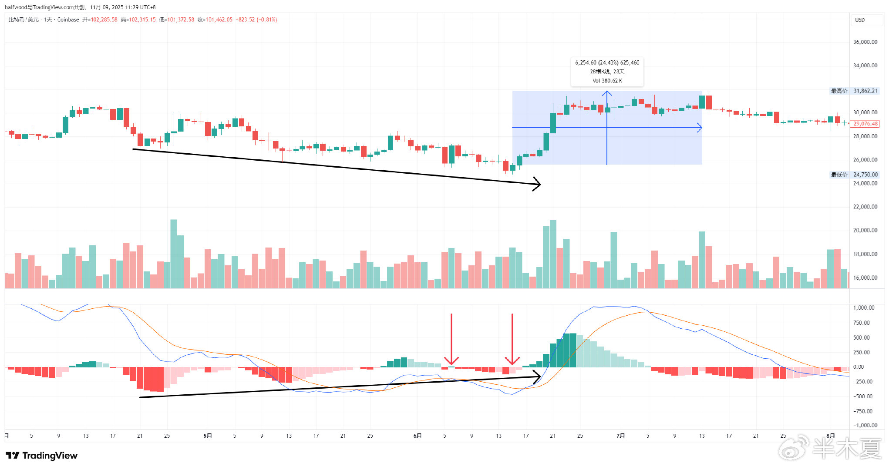
<figcaption>2023年6月15日MACD柱形图三段底背离</figcaption>
</figure>

这次也出现了一次虚假信号，6月6日收盘红柱缩短，甚至出现了绿柱，但是第二天绿柱不但没有继续延长，反而出现了红柱，这时候就需要止损了。这次27243入场，26346止损，跌幅3.3%。

后面在15号继续出现了入场信号，收盘价格25569，经过28天到达高点31862，涨幅24.4%左右。

 

2.4  2019年12月18日

<figure class="image">
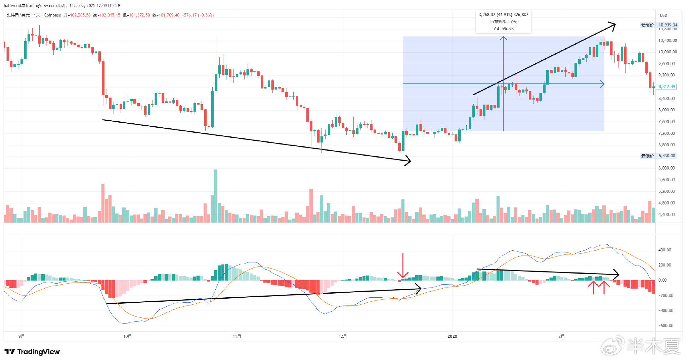
<figcaption>2019年12月18日MACD柱形图三段底背离</figcaption>
</figure>

12月18日收盘确定红柱缩短，甚至出现了绿柱。收盘价7285，经过57天到达高点10522，涨幅45%左右。这次同时也出现了MACD线的三段背离，看涨意义很强。有意思的是这次后面也紧接着三段顶背离，又是一次用MACD柱形图三段背离完成了整个交易。

 

2.5  2018年6月25日

<figure class="image">
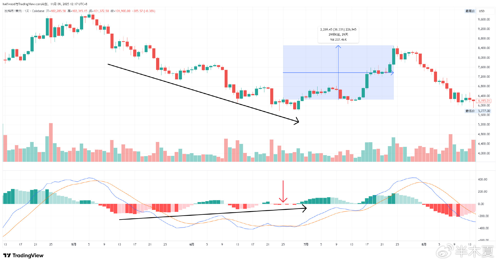
<figcaption>2018年6月25日MACD柱形图三段底背离</figcaption>
</figure>

6月25日收盘确定入场信号出现，但是第二天按照规则就要止损了。6246入场，6074止损，损失2.8%。因为止损后没有出现新的低点，所以没有再出现入场信号了。虽然后面的涨幅很大，但是单独按照我这个规则来交易的话，这会是一次失败的交易，但好在损失不算很大。

 

2.6  2018年2月6日

<figure class="image">
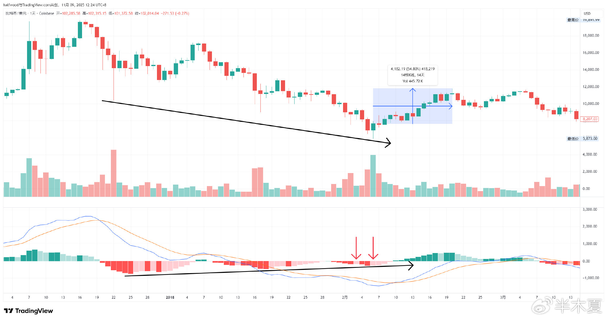
<figcaption>2018年2月6日MACD柱形图三段底背离</figcaption>
</figure>

2月3日出现了一次入场信号，但是第二天红柱没有缩短，所以这次又会是一次止损的交易。3日收盘9240入场，4日收盘8167止损，损失8.6%。可以看到比特币6年前价格比较低的时候的价格波动还是很大的。

2月6日再次出现入场信号，7688入场，经过14天到达高点11775，涨幅54.8%左右。相对54%的涨幅，8.6%的损失是可以接受的。

 

       最近7年日线级别的MACD柱形图三段底背离也是出现了6次，成功率也是很不错的，但同时也可以看出严格执行止损规则的重要性，尤其在应对虚假信号的时候。

 

## 总结

本文对MACD柱线图三段背离做了比较详细和系统的说明，任何单一的指标或者形态都不是万能的，尤其是高胜率的指标更要警惕，一定不能因为胜率高而忽略了止损退出计划。

本文列举的日线级别交易入场都是以收盘确定成立以后，以收盘价入场。成熟的有经验的交易员当然可以通过4H级别的走势提前判断当天收盘后指标是否会成立，进而提前入场。

交易从来不是一件简单的事情，不断地学习，不断总结经验，保持开放的思维，在交易的道路上才能踩下坚实的脚印。
